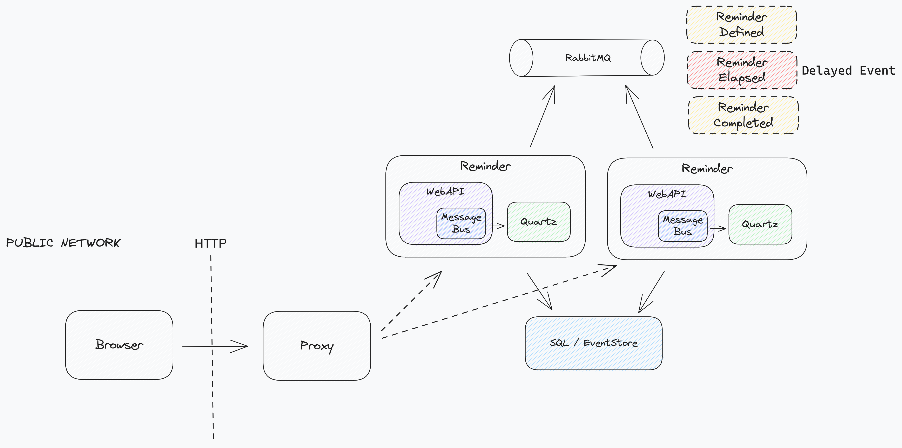

# Reminder API



## Running

### Staging

Based on a containerized system, the staging environment is provided via Docker Compose. On the `appsettings.Staging.json` the integrations are configured by name, taking advantage from the Docker
network interface with DNS services.

#### Docker-compose

The resources were split into two files:

- [`docker-compose.Staging.Infrastructure.yaml`](./docker-compose.Staging.Infrastructure.yaml), connection ports are privately exposed only;
- [`docker-compose.Staging.Services.yaml`](./docker-compose.Staging.Services.yaml), services connected by DNS names.

```bash
docker-compose \
-f ./docker-compose.Staging.Infrastructure.yaml \
-f ./docker-compose.Staging.Services.yaml \
up -d
```

##### Deployment

Replicas count and resources allocation can be configured straight on respective composes files:

```yaml
deploy:
  replicas: 2
  resources:
    limits:
      cpus: '0.50'
      memory: 200M
```

### Usage

> "address": `http://`**reminder**`:5000/api/v1/reminders`

```http request
###
POST http://reminder:5000/api/v1/reminders
Content-Type: application/json

{
  "hours": 0,
  "minutes": 0,
  "seconds": 30,
  "address": "http://reminder:5000/api/v1/reminders"
}

###  HTTP/1.1 200 OK
###  {
###    "id": "381b213b-5bc9-4efe-ac00-b10227794b7c",
###    "status": "Active",
###    "timeLeft": 28.6739571
###  }

### 
GET http://reminder:5000/api/v1/reminders/381b213b-5bc9-4efe-ac00-b10227794b7c

###  HTTP/1.1 200 OK
###  {
###    "id": "381b213b-5bc9-4efe-ac00-b10227794b7c",
###    "status": "Completed",
###    "timeLeft": 0
###  }
```

### Development

The respective [./docker-compose.Development.Infrastructure.yaml](./docker-compose.Development.Infrastructure.yaml) will provide all the necessary resources, with public exposure to the connection
ports:

```bash
docker-compose -f ./docker-compose.Development.Infrastructure.yaml up -d
```
### Usage

> "address": `http://`**localhost**`:5000/api/v1/reminders`

```http request
###
POST http://localhost:5000/api/v1/reminders
Content-Type: application/json

{
  "hours": 0,
  "minutes": 0,
  "seconds": 30,
  "address": "http://localhost:5000/api/v1/reminders"
}

###  HTTP/1.1 200 OK
###  {
###    "id": "381b213b-5bc9-4efe-ac00-b10227794b7c",
###    "status": "Active",
###    "timeLeft": 28.6739571
###  }

### 
GET http://localhost:5000/api/v1/reminders/381b213b-5bc9-4efe-ac00-b10227794b7c

###  HTTP/1.1 200 OK
###  {
###    "id": "381b213b-5bc9-4efe-ac00-b10227794b7c",
###    "status": "Completed",
###    "timeLeft": 0
###  }
```

